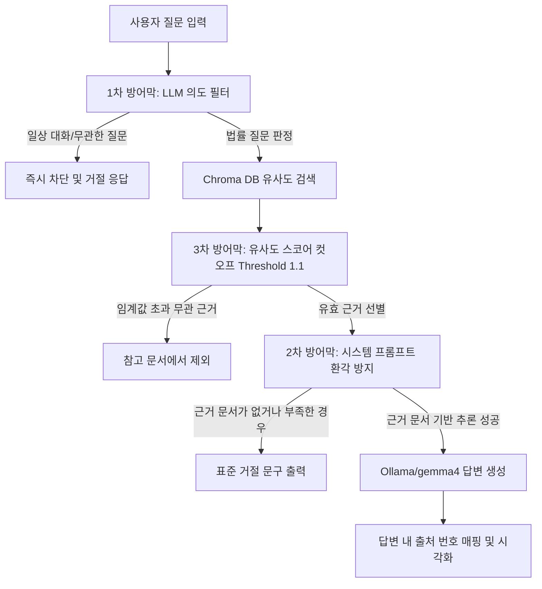

# [리걸 AI 서비스] 로컬 RAG 시스템 개념 및 작동 원리 가이드 (Beginner's Guide)

본 가이드는 RAG(Retrieval-Augmented Generation) 시스템을 처음 접하는 초보자 분들을 위해 RAG의 핵심 개념, 동작 흐름, 그리고 우리 프로젝트에 적용된 삼중 가드레일 기술 및 AI Hub 데이터셋의 실체를 상세히 설명합니다.

---

## 1. RAG(검색 증강 생성)의 핵심 개념

### 💡 오픈북 시험(Open-Book Exam) 비유
* **일반 LLM (Gemma-4, Llama-3 등)**: 공부는 매우 잘하지만 교과서가 없어 머릿속 기억만으로 시험을 치르는 학생입니다. 모르는 법률 문제가 나오면 그럴듯한 거짓말을 지어내는 **환각(Hallucination) 현상**이 발생합니다.
* **벡터 DB (Chroma DB)**: 전국의 판례와 법령을 꽂아둔 거대한 **책장**입니다. 컴퓨터가 읽기 편하도록 숫자의 형태(벡터)로 정보가 저장되어 있습니다.
* **임베딩 모델 (bge-m3)**: 도서관의 **도서 분류기**입니다. 사용자의 질문을 분석해 *"이 질문은 형사법 판례 3층 7번 서가(벡터 좌표)에 가깝다"*라고 매핑해 주는 다리 역할을 합니다.
* **RAG 시스템**: 사용자가 질문을 하면, **임베딩 모델**이 서재(Chroma)에서 관련 판례 3장을 뽑아낸 뒤, **LLM**에게 *"이 3장의 정보에만 기반해서 답안지를 써내라"* 하고 **오픈북 시험**을 치르게 유도하는 전체 시스템을 말합니다.

---

## 2. 삼중 가드레일 및 출처 표기 작동 원리

대한민국 법률 AI 서비스는 0.1%의 법적 인과관계 왜곡도 허용되지 않아야 하므로, 아래와 같은 **삼중 가드레일**과 **출처 인용 아키텍처**를 설계하여 방어합니다.



### [1차 방어막] LLM 기반 질문 의도 분류 (Intent Filter)
* **목적**: 법률과 전혀 상관없는 일상 질문(예: 짜장면 레시피, 인사 등)이 유입되는 것을 초반에 걸러냅니다.
* **원리**: 가벼운 LLM 프롬프트를 사용해 입력 질문이 법률 도메인인지 `YES/NO`로 신속히 판정하며, 일반 질문인 경우 무거운 검색 및 생성 연산을 거치지 않고 입구에서 차단합니다.

### [2차 방어막] 시스템 프롬프트 환각 차단 (System Prompt Defender)
* **목적**: 검색된 판례가 질문과 일치하지 않거나, 제공된 데이터 안에 관련 법률이 없는 경우 모델이 상상해서 법을 지어내는 현상을 막습니다.
* **원리**: LLM에게 강한 시스템 명령어(System Prompt)를 입력하여 *"제공된 참고 법률 문서에 명확한 근거가 없는 경우, 무조건 '제공된 법률 데이터 내에서는 관련 내용을 찾을 수 없어 답변이 불가능합니다.'라는 규격화된 거절 문구만 반환해라"* 하고 강제합니다.

### [3차 방어막] 유사도 점수 컷오프 기반 근거 제외 (Vector Score Cutoff)
* **목적**: 질문과 연관성이 현저히 떨어지는 엉뚱한 법률 청크가 LLM에게 컨텍스트(참고 힌트)로 전달되어 거짓 답변의 빌미를 주는 것을 차단합니다.
* **원리**: Chroma DB 유사도 검색 시 계산되는 거리 점수(Distance Score)가 임계값(Threshold = 1.1)보다 큰 경우, 해당 청크를 제외하여 LLM의 입력값에 포함되지 않도록 물리적으로 필터링합니다.

### [답변 내 근거 출처 표기 의무화 (Citation)]
* **원리**: LLM은 생성된 각 문장 끝에 해당 사실의 근거가 된 컨텍스트 번호 `[출처 1]`, `[출처 2]`를 의무적으로 명시하고, 화면 UI 하단에는 참조된 법률의 상세 정보(사건번호, 선고일자 등)를 표시하여 검증할 수 있도록 돕습니다.

---

## 3. AI Hub 데이터셋의 실체 및 가치

제공받으신 AI Hub 데이터셋은 AI RAG 시스템에 필요한 핵심 3대 구성 요소를 모두 내포하고 있습니다.

1. **원천데이터 (CSV 파일들)**:
   * 헌법재판소 결정례, 판결문, 법령 텍스트가 정제된 표 형태로 정렬되어 있습니다.
   * **RAG에서의 역할**: 우리가 구축할 Chroma DB의 **'교과서 원문'**입니다. (파이프라인을 거쳐 벡터로 저장됨)
2. **라벨링데이터 (JSON 파일들)**:
   * 법률 전문가들이 원천데이터를 기반으로 사전에 수작업으로 입력해 둔 질문(`input`)과 모범 답안(`output`) 세트입니다.
   * **RAG에서의 역할**: RAG 시스템의 성능을 정량적으로 평가 및 점수화하기 위한 **'모의고사 시험지'**입니다.
3. **AI 학습 모델 파일 (`criminal-qa-best` 등)**:
   * Llama-3-Open-Ko-8B 모델에 위 데이터셋을 주입하여 사전 학습(Fine-Tuning)시켜 둔 가중치 파일입니다.
   * **RAG에서의 역할**: 일반 Gemma-4보다 대한민국 법률 지식과 한자어 이해도가 뛰어난 **'전문가 두뇌(LLM)'**로써 Gemma-4의 역할을 대체하거나 다단계 검증용으로 활용됩니다.

---

## 4. 모듈화된 파이썬 소스코드의 상세 역할

프로젝트 디렉토리 내의 파일들은 단일 책임 원칙(SRP)에 의해 완벽하게 독립되어 있습니다.

* **[config/settings.py](file:///C:/develop/father/rag/first/config/settings.py)**: DB 경로, 임계값(`1.1`), Ollama 서버 주소, 모델명(`gemma4`, `bge-m3`)을 총괄 제어하는 설정 파일.
* **[core/parser.py](file:///C:/develop/father/rag/first/core/parser.py)**: 원천 데이터 CSV와 라벨링 데이터 JSON을 유기적으로 엮어 사건명, 선고일자 등이 포함된 메타데이터 꼬리표를 만드는 전처리기.
* **[core/splitter.py](file:///C:/develop/father/rag/first/core/splitter.py)**: 긴 판례 본문을 문맥 유지를 위해 약 800자 단위의 조각(Chunk)으로 잘게 쪼개주는 문서 분할기.
* **[core/embedding.py](file:///C:/develop/father/rag/first/core/embedding.py)**: Ollama의 `bge-m3` 번역 엔진을 구동해 텍스트 조각을 숫자 목록(벡터)으로 인코딩하는 모듈.
* **[core/vector_db.py](file:///C:/develop/father/rag/first/core/vector_db.py)**: Chroma 로컬 DB 엔진을 생성하고, 벡터화된 법률 데이터를 디스크 공간(`data/chroma_db`)에 안전하게 쓰고 읽어오는 파일.
* **[agents/guardrail_agent.py](file:///C:/develop/father/rag/first/agents/guardrail_agent.py)**: 1차 의도 분류 및 3차 유사도 컷오프를 실제 실행하여 프로세스 흐름을 차단하거나 필터링하는 가드레일 에이전트.
* **[agents/llm_agent.py](file:///C:/develop/father/rag/first/agents/llm_agent.py)**: 2차 시스템 프롬프트 환각 방지 규칙과 문장 끝 인라인 출처 매핑을 적용하여 Gemma-4 기반의 답변을 작성해 주는 에이전트.
* **[ingest.py](file:///C:/develop/father/rag/first/ingest.py)**: `core/`에 구현된 파서를 구동해 AI Hub 데이터를 한 번에 로컬 Chroma DB에 저장하고 책장을 정렬하는 실행 프로그램.
* **[app.py](file:///C:/develop/father/rag/first/app.py)**: FastAPI 기반의 서버로써 웹 브라우저에서 날아온 질문에 대해 전체 RAG 가드레일 파이프라인을 가동하는 중앙 기지국.
* **[evaluate_rag.py](file:///C:/develop/father/rag/first/evaluate_rag.py)**: AI Hub의 JSON 시험지를 로드해 RAG 시스템에 대입해 보고, 모범 답안과 RAG 답변을 콘솔 화면에 대조 분석 및 채점해 주는 자동 벤치마크 테스트기.
* **[templates/index.html](file:///C:/develop/father/rag/first/templates/index.html)**: 챗GPT 스타일의 실시간 법률 대화창 웹 GUI 및 출처 아코디언 카드 뷰.

---

## 5. 실무에서의 RAG 고도화 패턴: 다단계 생성 (Multi-Stage Chain)

현재는 시스템의 복잡도를 낮추고 로컬 PC의 하드웨어 리소스를 아끼기 위해 **[Chroma DB -> 가드레일 -> gemma4]** 단일 추론 구조를 채택하고 있습니다. 

그러나 법률과 같이 극도로 정밀한 가독성과 팩트 체크가 동시에 요구되는 현업 비즈니스에서는 다음과 같은 **다단계 체인(Retrieve-Draft-Refine)** 방식을 차용합니다.

1. **지식 검색 및 인출 (Chroma DB & bge-m3)**: 쿼리와 연관성 높은 판례 조각 획득.
2. **초안 작성 (Drafting - 리걸 LLM `criminal-qa-best`)**: 획득한 법률 텍스트를 정밀 분석하여 팩트 손상 없이 **"엄격하고 명확한 법률 초안"**을 전문 용어 중심으로 기술합니다.
3. **가독성 가공 (Refining - 범용 LLM `gemma4`)**: 작성된 딱딱한 법률 문장을 받아서, 의미와 법적 조항은 그대로 유지한 채 유저가 이해하기 쉽도록 부드러운 말투로 **윤문(다듬기)**하여 최종 출력합니다.

---

## 6. AI Hub Docker 이미지 및 모델(LoRA) Ollama 연동 방법

### 🐳 1) 제공된 Docker(도커) 파일의 정체 (학습 환경 복제 및 사용 여부)
* **결론부터 말씀드리면**: 만약 이미 완료된 학습 결과물(`criminal-qa-best`)을 가져다 쓰기만 할 예정이라면, **도커(Docker)는 전혀 필요가 없으므로 무시하셔도 무방합니다.**
* **학습 환경의 복제**: AI Hub 개발진은 CUDA 드라이버, PyTorch, Hugging Face `transformers` 등 설치가 매우 무겁고 복잡한 GPU용 파이썬 환경을 미리 세팅하여 도커 이미지(`3.도커이미지`)로 배포했습니다. 개발진은 이 도커 환경 내부에서 학습 소스코드를 돌려 `criminal-qa-best` 모델을 최종 탄생시켰습니다.
* **언제 도커가 필요한가요?**: 
  1. 제공된 소스코드(`1.모델소스코드`)를 이용해 모델을 **처음부터 다시 학습(Fine-tuning)**시키거나, 
  2. 새로운 법률 데이터를 추가해서 **추가 학습(Continued Pre-training)**을 시키고 싶을 때만 이 도커 환경이 필요합니다.
* **단순 사용시(RAG 가동 시)**: 이미 완제품(`criminal-qa-best`) 모델이 제공되었으므로, 이를 Ollama용 GGUF 포맷으로 **변환 및 로드**하여 사용하기만 하면 되기 때문에 무거운 도커 컨테이너를 실행할 필요가 전혀 없습니다.

### 🧠 2) `criminal-qa-best` 모델(LoRA)을 Ollama에 탑재하는 방법
* **Q: LoRA 어댑터이므로 베이스 모델인 Llama-3-Open-Ko-8B-Instruct-preview 모델이 필요한가요?**
  * **네, 반드시 필요합니다!** LoRA 모델(`criminal-qa-best`)은 전체 가중치 중 1.5% 내외의 변화량(약 167MB)만 가지고 있어 홀로 존재할 수 없습니다. 반드시 약 16GB에 달하는 오리지널 베이스 모델과 결합해야 작동합니다.
* **Q: ComfyUI는 로컬 LoRA를 동적으로 연결하는데, Ollama는 어떻게 연결하나요?**
  * ComfyUI는 실행 환경(VRAM)에서 베이스 모델과 LoRA 어댑터를 실시간으로 각각 로드하여 동적으로 체인을 만듭니다.
  * 하지만 **Ollama는 실행 단계에서의 동적 LoRA 결합을 지원하지 않습니다.** (단일 GGUF 파일만 실행 가능)
  * 따라서 Ollama에 적용하려면 파이썬 레벨에서 베이스 모델과 LoRA를 **정적 병합(Static Merge)**하여 하나의 통합 모델 폴더로 합친 뒤, 이를 GGUF로 최종 변환하는 방식을 취해야 합니다. (Ollama Modelfile 내에 `ADAPTER` 명령어를 쓸 수도 있으나 변환 호환성 문제로 실무에서는 정적 병합을 강력 권장합니다.)

이를 Ollama에서 구동하려면 다음 **3단계 변환 파이프라인**을 실행해야 합니다.

#### [1단계] 베이스 모델과 LoRA 어댑터 병합 (Merge)
파이썬 스크립트를 작성하여 Hugging Face의 `peft` 라이브러리로 베이스 모델과 제공받은 어댑터 가중치를 하나로 합쳐서 완벽한 풀-모델(Full-weights) 폴더로 내보냅니다.
```python
from transformers import AutoModelForCausalLM, AutoTokenizer
from peft import PeftModel

base_model_path = "beomi/Llama-3-Open-Ko-8B-Instruct-preview"
adapter_model_path = "./criminal-qa-best"

# 1. 베이스 모델 및 토크나이저 로드
base_model = AutoModelForCausalLM.from_pretrained(base_model_path, device_map="auto")
tokenizer = AutoTokenizer.from_pretrained(base_model_path)

# 2. Peft(LoRA) 어댑터 결합
model = PeftModel.from_pretrained(base_model, adapter_model_path)

# 3. 모델 가중치 물리적 병합 및 저장
merged_model = model.merge_and_unload()
merged_model.save_pretrained("./merged-legal-llama3")
tokenizer.save_pretrained("./merged-legal-llama3")
```

#### [2단계] llama.cpp를 활용한 GGUF 변환 및 양자화 (Quantization)
1. `llama.cpp` 오픈소스 레포지토리를 복사하여 변환 파이썬 스크립트를 실행합니다. (Hugging Face 포맷 모델을 단일 GGUF 파일로 번역)
   ```bash
   python llama.cpp/convert_hf_to_gguf.py ./merged-legal-llama3 --outfile legal-llama3.gguf
   ```
2. 80억 개(8B)의 매개변수가 들어있는 GGUF 파일은 용량이 너무 크고 로컬 GPU에서 무겁기 때문에, **양자화(Quantization, 가중치 압축)**를 진행해 실행 속도를 가속하고 용량을 줄입니다. 이 양자화 비트 수는 명령의 마지막 인자를 수정하여 **자유롭게 조절 가능**합니다.
   ```bash
   llama.cpp/quantize ./legal-llama3.gguf ./legal-llama3-Q4_K_M.gguf Q4_K_M
   ```
   * **양자화 옵션 및 VRAM 요구량 (8B 모델 기준)**:
     * **`Q8_0` (8비트 압축)**: 모델 용량 약 8.5GB. VRAM 요구량 약 10GB 이상. (8GB 그래픽카드에서는 구동 불가 또는 버벅임)
     * **`Q5_K_M` (5비트 중간 압축)**: 모델 용량 약 5.7GB. VRAM 요구량 약 7GB 내외. (8GB 그래픽카드에서 아슬아슬하게 구동 가능)
     * **`Q4_K_M` (4비트 중간 압축 - 강력 추천/기본값)**: 모델 용량 약 4.8GB. VRAM 요구량 약 6GB 내외. (8GB 그래픽카드에서 윈도우 시스템 및 웹브라우저 메모리를 감안했을 때 가장 속도가 빠르고 성능 저하가 없는 **골디락스 구간**)
     * **`Q3_K_M` (3비트 중간 압축 - 초경량)**: 모델 용량 약 3.8GB. VRAM 요구량 약 5GB 내외. (8GB 그래픽카드에서 아주 여유롭게 돌아가지만, 법률 문장의 논리 전개나 세부 용어가 약간 뭉개지는 성능 손실이 발생할 수 있음)
     * **`Q2_K` (2비트 압축 - 극단적 압축)**: 모델 용량 약 3.2GB. VRAM 소모는 매우 적으나 지능이 심각하게 손상되므로 비추천.

#### [3단계] Ollama에 모델 등록 및 사용
1. 변환 완료된 `legal-llama3-Q4_K_M.gguf` 파일과 동일한 위치에 아래 내용으로 `Modelfile`이라는 이름의 텍스트 파일을 생성합니다.
   ```dockerfile
   FROM ./legal-llama3-Q4_K_M.gguf
   TEMPLATE """{{ if .System }}<|start_header_id|>system<|end_header_id|>

   {{ .System }}<|eot_id|>{{ end }}{{ if .Prompt }}<|start_header_id|>user<|end_header_id|>

   {{ .Prompt }}<|eot_id|>{{ end }}<|start_header_id|>assistant<|end_header_id|>

   {{ .Output }}<|eot_id|>"""
   PARAMETER stop "<|start_header_id|>"
   PARAMETER stop "<|end_header_id|>"
   PARAMETER stop "<|eot_id|>"
   PARAMETER num_ctx 8192
   ```
2. 터미널 창에 Ollama CLI 명령을 실행해 모델을 빌드합니다.
   ```bash
   ollama create criminal-qa -f Modelfile
   ```
3. 빌드가 끝나면 [settings.py](file:///C:/develop/father/rag/first/config/settings.py)의 `OLLAMA_LLM_MODEL` 설정을 `"criminal-qa"`로 바꾸는 것만으로 로컬 RAG 시스템의 두뇌를 Gemma-4에서 **형사법 최적화 모델**로 즉각 스위칭하여 구동할 수 있습니다.
