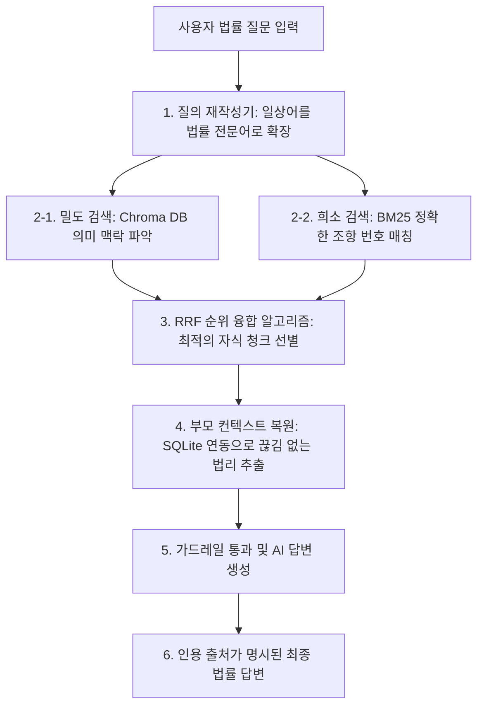

# [제안서] 법무법인 전용 프라이빗 RAG 지식 관리 및 검색 플랫폼 도입 제안

**수신**: 법무법인 대표변호사 귀하  
**제안일**: 2026년 6월 5일  
**제안명**: AI 기반 프라이빗 법률 지식 자산화 및 고속 하이브리드 RAG 검색 플랫폼 구축

---

## 1. 제안 배경: 로펌 경영의 3대 도전 과제
현대 법률 시장에서 법무법인이 지속 가능한 성장을 이루기 위해서는 지식 관리의 효율화와 변호사의 고부가가치 집중 환경 조성이 필수적입니다. 현재 많은 로펌은 다음과 같은 경영적 한계에 직면해 있습니다.

1. **지식 유실 리스크 (Knowledge Leakage)**: 에이스 변호사나 파트너 변호사의 이직 및 퇴사 시, 그동안 축적된 승소 소장 작성 노하우와 법리 분석 지식이 고스란히 유출됩니다.
2. **생산성 저하 (Productivity Drain)**: 어소(초임) 변호사들이 유사 판례 및 조문을 수작업으로 검색하고 검토하는 단순 반복 업무에 매일 수시간씩 낭비하고 있으며, 이는 고스란히 로펌의 인건비 비용으로 누수됩니다.
3. **수임 경쟁 심화 (Intake Conversion)**: 의뢰인과의 초기 상담 시 신속하고 정확하게 승소 가능성 및 유사 사례를 제시하지 못하면 의뢰인은 대기하지 않고 즉시 경쟁 로펌으로 이탈합니다.

---

## 2. 해결 방안: 로펌 전용 프라이빗 RAG 플랫폼
본 제안서는 법무법인이 수년간 축적해 온 **내부 비공개 서면(소장, 준비서면, 검토 의견서)**과 **공공 판례 및 법령 데이터**를 결합하여, 유출 우려가 없는 폐쇄적인 환경에서 초고속으로 최적의 법리를 찾아내는 **'프라이빗 RAG(Retrieval-Augmented Generation) 시스템'** 도입을 제안합니다.

변호사를 대체하는 기술이 아닙니다. **"변호사의 단순 업무 시간을 제로화하고, 로펌의 무형 지식을 영구적인 시스템 자산으로 귀속시키는 경영 도구"**입니다.

---

## 3. 대표변호사를 위한 4대 기대 효과 (ROI)

### ① 지식의 자산화 (Collective Intelligence)
* **어소 변호사가 작성한 과거의 우수 서면과 승소 레시피를 데이터베이스화**합니다.
* 담당 변호사가 변경되거나 퇴사하더라도 로펌 내부의 공동 지능으로 영구 귀속되어, 로펌 전체의 평균 승소율과 서면 퀄리티를 상향 평준화합니다.

### ② 단순 서치 업무 단축을 통한 마진율 극대화
* 기존에 2~3시간씩 걸리던 판례 리서치 및 조문 대조 작업을 **단 10초 만에 완료**합니다.
* 단순 리서치 노동이 줄어듦으로써 변호사는 변론 전략 수립 및 의뢰인 밀착 케어와 같은 핵심 부가가치 업무에 집중할 수 있으며, 고정 수임료 사건의 마진율이 획기적으로 상승합니다.

### ③ 초기 상담 신뢰도 확보를 통한 수임 성공률 극대화
* 의뢰인과의 초진 상담 과정에서 즉시 질문을 입력하면, **과거 우리 로펌이 다루었던 가장 유사한 승소 판결 사례와 판결 요지를 실시간으로 추출**하여 브리핑할 수 있습니다.
* 데이터 기반의 확신 있는 초기 상담은 의뢰인의 로펌 신뢰도를 극대화하여 현장 수임률을 상승시킵니다.

### ④ 품질 관리(QC) 및 서면 리스크 제로화
* 신입 변호사가 소장 작성 시 최신 판례 동향을 놓치거나 구법 조항을 적용하는 실수를 예방합니다.
* AI 채점관(LLM Judge) 및 임베딩 의미 검색 가드레일이 적용된 시스템이 변호사의 서면 논리 구조를 더블 체크하여 패소 리스크를 사전에 방지합니다.

---

## 4. 핵심 기술 차별점 (하이브리드 RAG 엔진)

본 플랫폼은 기존의 단순한 키워드 검색 엔진과 달리, 최신 AI 기술이 융합된 **2단계 하이브리드 검색 아키텍처**를 채택하고 있습니다.

* **부모-자식(Parent-Child) 컨텍스트 구조**: 문서를 잘라 검색할 때는 정밀한 조각(자식)으로 빠르게 찾아내고, LLM에 전달할 때는 전체 맥락(부모 조항 전문)을 복원하여 제공하므로 문맥이 잘리거나 왜곡되는 환각 현상이 발생하지 않습니다.
* **질의 재작성기(Query Rewriter)**: 의뢰인이 말하는 일상적인 질문("차 훔쳐 타면 합의금 어떻게 해?")을 시스템이 알아서 법률적 전문 키워드("절도죄", "자동차등불법사용죄", "양형기준", "형사합의")로 번역하여 최적의 매칭 결과를 가져옵니다.

---

## 5. 완벽한 정보 보안 및 독점 격리 환경 구축

로펌의 소장과 판결 자료는 최고 수준의 보안이 유지되어야 합니다. 당사는 이를 해결하기 위해 **'독립형 프라이빗 SaaS'** 방식으로 시스템을 구축합니다.

1. **테넌트 격리 (Isolated Tenant)**: 각 로펌은 독립된 가상 서버 공간을 배정받습니다. A 로펌이 업로드한 소장 자료는 외부 AI 학습에 절대 공유되거나 혼입되지 않으며 오직 A 로펌 내부 변호사들만 접근할 수 있습니다.
2. **데이터 비저장 정책 (Zero-Data Retention)**: 기업용 전용 API 망 혹은 로컬 독립 서버를 활용하여 데이터 유출 경로를 원천 차단합니다.
3. **권한 제어 시스템**: 파트너 변호사, 어소 변호사, 스태프 등 직급에 따른 문서 접근 권한을 세분화하여 내부 통제를 강화합니다.

---

## 6. 도입 및 개발 로드맵

성공적인 플랫폼 안착을 위해 다음과 같은 단계별 파트너십 도입 방안을 제시합니다.

* **1단계: PoC 및 맞춤형 튜닝 (1~2개월)**
  - 제안사(개발사)와 법무법인 간 파트너십 체결
  - 법무법인의 실제 비공개 서면 샘플 및 맞춤형 카테고리(민사/형사/가사 등) 분류 체계 이식
  - 변호사 베타 테스트 단의 의견을 수렴하여 UI/UX 및 답변 정확도 1차 검증
* **2단계: 파일럿 적용 및 전체 데이터 이관 (1개월)**
  - 로펌 내 전체 어소 변호사 대상 시범 도입
  - 기존 승소 소장 및 판결 문서 전체 업로드 및 하이브리드 색인 구축
* **3단계: 정식 가동 및 유지보수**
  - 신규 소장 작성 및 판례 추가 시 실시간/증분 적재 시스템 가동

---

**본 플랫폼은 법무법인의 무형의 노하우를 유형의 독점적 자산으로 전환하는 가장 빠르고 안전한 지름길입니다.**  
귀사와의 성공적인 파트너십을 통해 국내 최고 수준의 AI 법률 지능을 함께 구축하기를 기대합니다.
